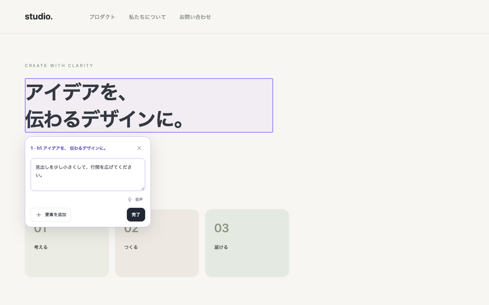
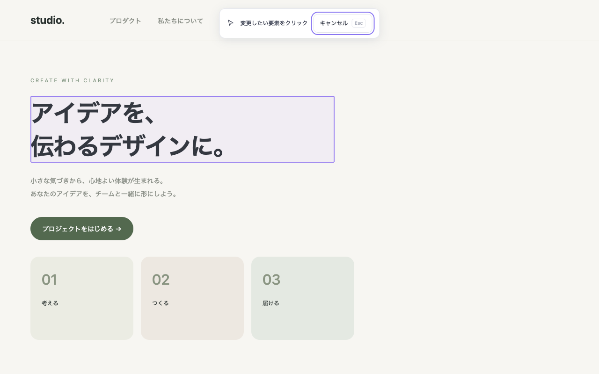
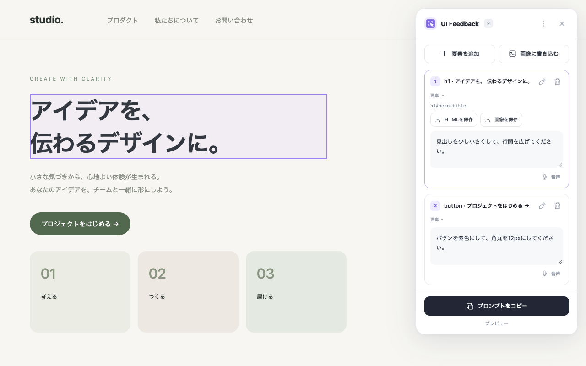
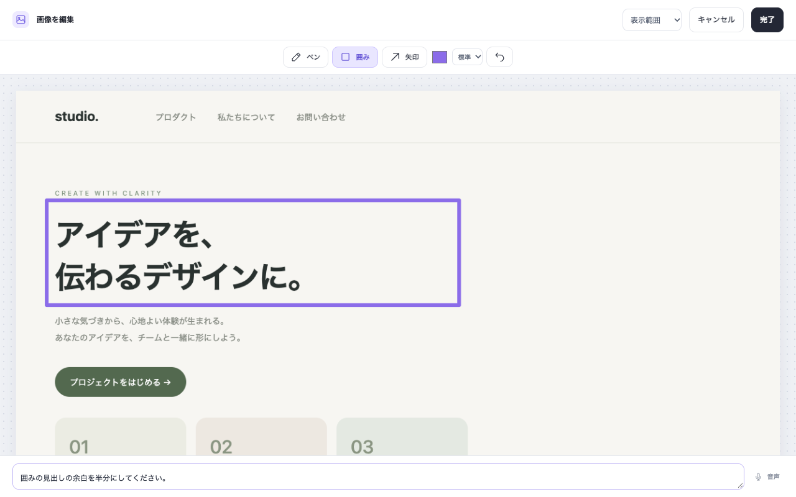

<div align="center">
  
  <h1>UI Feedback Capture</h1>
  <p><strong>ウェブの「ここを変えたい」を、AIへの修正指示に。</strong></p>
</div>

**ウェブページの要素を選び、コメントと画像をまとめてAIに渡せるChrome拡張です。**

「この見出しを小さく」「このボタンを紫色に」。変えたい場所をクリックして、その場で入力します。複数の指示をまとめてコピーすると、対象のHTML・CSS・位置も一緒に伝えられます。

<p align="center">
  
</p>

掲載画像はデモページで撮影した実装画面です。

## ボタンでできること

| ボタン・操作 | できること | 受け取れるもの |
| --- | --- | --- |
| 拡張アイコン／「要素を追加」 | ページ上の見出し・ボタン・画像・コンテナーなどをクリックして選択 | 対象の枠と、その場で入力できるコメント欄 |
| 「完了」 | 一覧へ戻り、複数の指示を確認・編集 | 要素ごとのコメント一覧 |
| 「プロンプトをコピー」 | 全件のコメントと対象情報をまとめてコピー | AIに貼り付けるテキスト形式の修正プロンプト |
| 「要素」→「HTMLを保存」 | 選択した要素のHTMLを保存 | HTMLファイル |
| 「要素」→「画像を保存」 | 選択した要素の表示を撮影して保存 | 要素のPNG画像 |
| 「画像に書き込む」→「撮影」 | 表示範囲・ページ全体を撮影し、ペン・囲み・矢印で注釈 | 注釈を付けた画像 |
| 添付画像のコピー／保存アイコン | 注釈画像を取り出す | クリップボードの画像／PNGファイル |
| 「音声」 | ブラウザー標準の日本語音声認識でコメントを入力 | コメント欄に追加される認識テキスト |

## 画面で見る使い方

### 1. 変更したい要素を選ぶ

拡張アイコンを押すと選択モードになります。マウスを重ねると対象に枠が付き、クリックすると枠の上・下にコメント欄が表示されます。「要素を追加」で別の場所にも続けて指示できます。Escで選択を終了できます。



### 2. 複数のコメントをまとめる・要素を保存する

「完了」で一覧へ戻ります。カードへのホバーで対象を確認し、ペンボタンでその場の編集に戻れます。「要素」を開くと、HTMLや要素のPNG画像を保存できます。



### 3. 画像に描いて伝える

「画像に書き込む」から撮影し、ペン・囲み・矢印で修正したい場所を示します。上部で表示範囲・ページ全体を切り替えられます。「完了」で添付し、画像をコピーまたはPNG保存します。



## 「プロンプトをコピー」で何が出る？

上の画面で、次の2件を入力した場合のコピー結果です。

1. 見出し：「見出しを少し小さくして、行間を広げてください。」
2. ボタン：「ボタンを紫色にして、角丸を12pxにしてください。」

修正したいことに加え、**タグ名・セレクター・DOMパス・現在の文言・位置・表示領域・CSS・HTML**が自動で付きます。以下は実際のコピーボタンから取得した内容で、URLだけを説明用の `https://example.com/` に置き換えています。

````text
# UI修正依頼

URL: https://example.com/
ページ: Studio — デザインのデモ

以下の要素を修正してください。セレクターと周辺情報から対象を確認してください。

## 1. h1「アイデアを、
伝わるデザインに。」
セレクター: h1#hero-title
DOMパス: html > body > main > h1#hero-title
現在の文言: アイデアを、
伝わるデザインに。
位置（ページ座標）: x=65, y=205, 幅=650, 高さ=143
表示領域: 1280×800 / スクロール: 0, 0
スタイル: {"display":"block","color":"rgb(41, 49, 47)","background-color":"rgba(0, 0, 0, 0)","font-family":"system-ui, sans-serif","font-size":"55px","font-weight":"650","line-height":"71.5px","text-align":"start","padding":"0px","margin":"24px 0px","border":"0px none rgb(41, 49, 47)","border-radius":"0px","width":"650px","height":"143px"}
HTML（抜粋）: <h1 id="hero-title">アイデアを、<br>伝わるデザインに。</h1>
修正指示: 見出しを少し小さくして、行間を広げてください。

## 2. button「プロジェクトをはじめる →」
セレクター: button#hero-cta
DOMパス: html > body > main > button#hero-cta
現在の文言: プロジェクトをはじめる →
位置（ページ座標）: x=65, y=464, 幅=220, 高さ=50
表示領域: 1280×800 / スクロール: 0, 0
スタイル: {"display":"inline-block","color":"rgb(255, 255, 255)","background-color":"rgb(83, 105, 79)","font-family":"system-ui, sans-serif","font-size":"15px","font-weight":"400","line-height":"24px","text-align":"center","padding":"13px 25px","margin":"20px 0px 35px","border":"0px none rgb(255, 255, 255)","border-radius":"30px","width":"219.703px","height":"50px"}
HTML（抜粋）: <button id="hero-cta">プロジェクトをはじめる →</button>
修正指示: ボタンを紫色にして、角丸を12pxにしてください。
````

[コピー結果をテキストファイルで見る](docs/examples/copied-prompt.txt)

このテキストを普段使っているAIへ貼り付けて、修正を依頼します。画像はテキストに含まれないため、画像のコピーまたはPNG保存で別途添付します。画像を添付した場合は、コピー結果の末尾に画像の注釈を参照する案内と、画像へのコメントが追加されます。

## 要素情報はどんなJSONになる？

コピーされるプロンプトの「スタイル」は、次のようなJSONです。同じデモの見出しから取得した値を整形しています。

```json
{
  "display": "block",
  "color": "rgb(41, 49, 47)",
  "background-color": "rgba(0, 0, 0, 0)",
  "font-family": "system-ui, sans-serif",
  "font-size": "55px",
  "font-weight": "650",
  "line-height": "71.5px",
  "text-align": "start",
  "padding": "0px",
  "margin": "24px 0px",
  "border": "0px none rgb(41, 49, 47)",
  "border-radius": "0px",
  "width": "650px",
  "height": "143px"
}
```

タグ・HTML・位置なども含めた要素情報の構造は、次のようになります。**これは内部で取得・保存するデータの例です。現在のコピー形式は上記のテキストで、JSONファイルを出力するボタンはありません。**

<details>
<summary>見出し1件の要素情報をJSONで見る</summary>

```json
{
  "exportHtml": "<h1 id=\"hero-title\">アイデアを、<br>伝わるデザインに。</h1>",
  "tag": "h1",
  "selector": "h1#hero-title",
  "path": "html > body > main > h1#hero-title",
  "text": "アイデアを、\n伝わるデザインに。",
  "html": "<h1 id=\"hero-title\">アイデアを、<br>伝わるデザインに。</h1>",
  "styles": {
    "display": "block",
    "color": "rgb(41, 49, 47)",
    "background-color": "rgba(0, 0, 0, 0)",
    "font-family": "system-ui, sans-serif",
    "font-size": "55px",
    "font-weight": "650",
    "line-height": "71.5px",
    "text-align": "start",
    "padding": "0px",
    "margin": "24px 0px",
    "border": "0px none rgb(41, 49, 47)",
    "border-radius": "0px",
    "width": "650px",
    "height": "143px"
  },
  "bounds": {
    "x": 65,
    "y": 205,
    "width": 650,
    "height": 143
  },
  "viewport": {
    "width": 1280,
    "height": 800,
    "scrollX": 0,
    "scrollY": 0
  },
  "instruction": "見出しを少し小さくして、行間を広げてください。"
}
```

</details>

[要素情報のJSON例をファイルで見る](docs/examples/element-information.json)

## 詳しく見る

| 知りたいこと | ドキュメント |
| --- | --- |
| Chromeに入れて使い始める | [セットアップ](docs/SETUP.md) |
| コメント・画像・音声の使い方 | [使い方](docs/USAGE.md) |
| 使用技術・コード構成・開発・配布 | [技術構成と開発ガイド](docs/DEVELOPMENT.md) |
